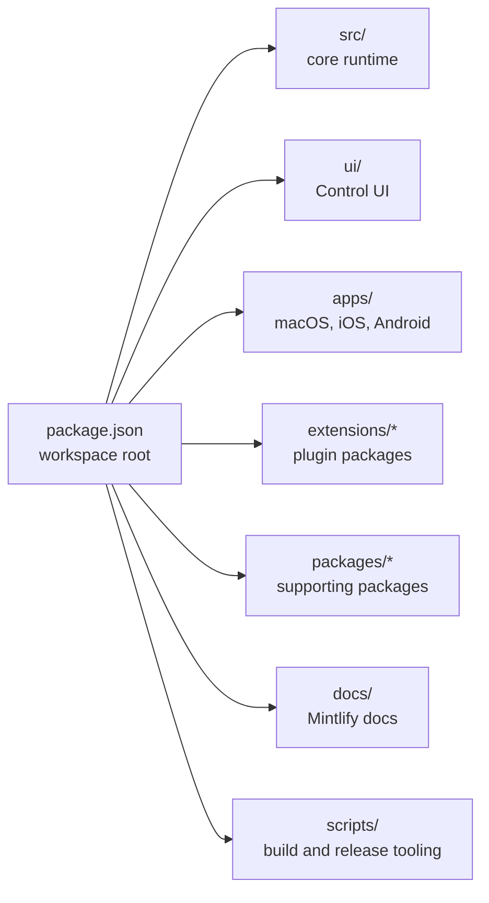
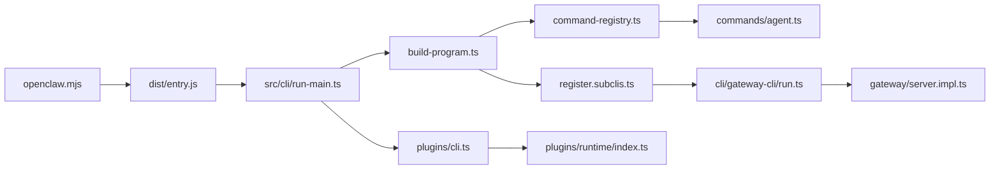
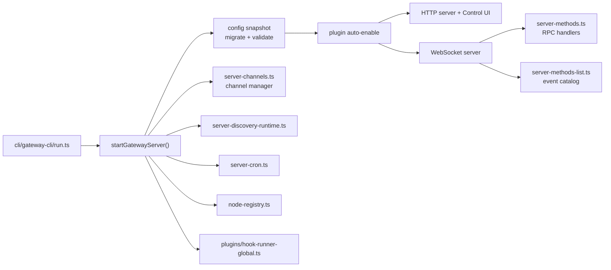
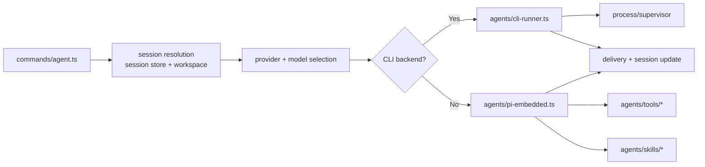

# Repository map

Last updated: 2026-02-27

This page is a contributor-facing map of the OpenClaw monorepo. It complements the runtime-focused [Gateway architecture](/concepts/architecture) page by showing where code lives, which entrypoints matter, and how control moves through the system.

## How to read this repo

OpenClaw is organized around one central runtime:

- The `openclaw` CLI starts commands, local tools, or the long-lived Gateway.
- The Gateway owns the main WebSocket control plane, browser UI, channel adapters, and node connections.
- The agent runtime sits behind the Gateway and can execute either embedded Pi runs or external CLI backends.
- Plugins and extensions attach at channel, tool, provider, memory, and diagnostics seams.
- UI and native apps are clients of that control plane, not separate backends.

## Top level directories

| Path | Purpose |
| --- | --- |
| `src/` | Core TypeScript runtime: CLI, gateway, agents, channels, routing, plugins, infra |
| `extensions/` | Workspace extension packages, mostly channel and provider plugins |
| `ui/` | Browser Control UI frontend |
| `apps/` | Native Apple and Android clients plus shared protocol and UI code |
| `packages/` | Supporting packages such as `clawdbot` and `moltbot` |
| `docs/` | Mintlify docs, including architecture and command references |
| `scripts/` | Build, release, test, bundling, and maintenance scripts |
| `test/` | Higher-level test assets outside colocated `*.test.ts` files |
| `assets/` | Static project assets used in builds and docs |
| `vendor/` | Vendored third-party code or static bundles |

## Monorepo topology

## Main entrypoints

The most important files to understand first:

| File | Role |
| --- | --- |
| `openclaw.mjs` | Published binary shim that imports built `dist/entry.js` or `dist/entry.mjs` |
| `src/cli/run-main.ts` | True runtime entry for the TypeScript CLI: env setup, routing, lazy command loading |
| `src/cli/program/build-program.ts` | Creates the Commander program and installs top-level command registries |
| `src/cli/program/command-registry.ts` | Lazy registration for core top-level commands |
| `src/cli/program/register.subclis.ts` | Lazy registration for sub-CLIs such as `gateway`, `models`, `nodes`, `plugins` |
| `src/cli/gateway-cli/run.ts` | Normalizes `gateway run` options, validates config, starts the Gateway |
| `src/gateway/server.impl.ts` | Main Gateway bootstrap and lifecycle orchestration |
| `src/gateway/server-methods-list.ts` | Canonical list of Gateway RPC methods and server-push events |
| `src/commands/agent.ts` | Main agent command orchestration for session, provider, model, and delivery |
| `src/agents/cli-runner.ts` | External CLI backend execution path |
| `src/plugins/runtime/index.ts` | Runtime bridge exposed to extensions |

## Control plane

The control plane is the path that starts processes, loads config, wires plugins, and exposes RPC.

### CLI boot sequence

`src/cli/run-main.ts` does five important things before a command runs:

1. Normalizes argv and loads `.env`.
2. Normalizes the process environment and ensures the CLI binary path is present when needed.
3. Applies runtime guards such as minimum supported Node version.
4. Optionally routes early to lightweight shortcuts.
5. Builds the Commander program, lazily registers the primary command, and loads plugin CLI commands only when the primary command is not already a built-in.

This keeps startup fast even though the repo contains a large command surface.

### Command registration model

The top-level command tree is intentionally split:

- `src/cli/program/command-registry.ts` owns core user workflows like `setup`, `onboard`, `configure`, `message`, `agent`, `status`, and `browser`.
- `src/cli/program/register.subclis.ts` owns infrastructure-oriented trees like `gateway`, `daemon`, `models`, `nodes`, `sandbox`, `plugins`, and `channels`.
- Both registries use lazy placeholders, then remove and re-register the real command tree when the command is actually invoked.

This is why command registration looks indirect at first glance. It is a startup optimization, not an architectural accident.

## Gateway runtime

The Gateway is the main long-lived process and the central control surface.

`src/gateway/server.impl.ts` is the coordination hub. It handles:

- Config migration and validation before binding ports
- Auto-enabling certain plugins based on environment or config
- Setting up auth and rate limiting
- Booting channel managers, node registries, cron services, discovery, maintenance timers, and the browser Control UI
- Maintaining long-lived caches and runtime snapshots such as secrets and remote skills

For protocol details, see [Gateway protocol](/gateway/protocol).

## Agent execution path

The agent pipeline is the bridge between inbound messages and model execution.

`src/commands/agent.ts` is the highest leverage file for agent behavior because it resolves:

- Agent identity and workspace
- Session file and session store placement
- Provider and model overrides
- Thinking level and verbosity
- Auth profile selection
- Delivery policy back into the original channel

The actual model execution then splits:

- `src/agents/cli-runner.ts` handles external CLI backends and wraps them in the process supervisor.
- `src/agents/pi-embedded.ts` handles the embedded Pi path with tools, streaming, and richer runtime context.

## Plugin and extension boundaries

There are two plugin layers:

- In-process plugin hooks inside `src/plugins/` and `src/channels/plugins/`
- Publishable workspace extensions under `extensions/`

`src/plugins/runtime/index.ts` is the bridge that exposes selected config, channel, tool, media, logging, and state helpers to extension code.

### Extension inventory

Current extension packages fall into a few buckets:

- Channel plugins: `bluebubbles`, `discord`, `feishu`, `googlechat`, `imessage`, `irc`, `line`, `matrix`, `mattermost`, `msteams`, `nextcloud-talk`, `nostr`, `signal`, `slack`, `synology-chat`, `telegram`, `tlon`, `twitch`, `whatsapp`, `zalo`, `zalouser`
- Provider and auth plugins: `copilot-proxy`, `google-gemini-cli-auth`, `minimax-portal-auth`
- Memory and workflow plugins: `memory-core`, `memory-lancedb`, `llm-task`, `lobster`, `open-prose`
- Platform and diagnostics plugins: `acpx`, `diagnostics-otel`, `voice-call`

When changing shared channel, routing, pairing, or message abstractions, inspect both `src/` and `extensions/`. The repo is explicitly designed so channel behavior is split across core and plugin packages.

## User surfaces

OpenClaw has several operator-facing clients:

| Path | Surface |
| --- | --- |
| `ui/` | Browser Control UI that talks to the Gateway |
| `apps/macos/` | macOS app shell and Gateway-adjacent control surface |
| `apps/ios/` | iOS client |
| `apps/android/` | Android client |
| `apps/shared/OpenClawKit/` | Shared Apple-side chat UI, protocol, and reusable runtime types |
| `src/tui/` | Terminal UI connected to the Gateway |

The common pattern is that these are clients of the Gateway control plane, not peer backends.

## Tests, builds, and release surfaces

The operational map is broad but predictable:

- Build entry: root `package.json` `build` script
- TypeScript checks: `pnpm tsgo`
- Lint and format checks: `pnpm check`
- Test matrix: `vitest.config.ts` plus specialized configs such as `vitest.gateway.config.ts`, `vitest.extensions.config.ts`, and `vitest.live.config.ts`
- Docs and release references: [Release reference](/reference/RELEASING), [Testing](/help/testing)

Colocated `*.test.ts` files are the default. Read `vitest*.ts` at the repo root when you need to understand how suites are partitioned.

## External automation setup

This repository is also used as an operational reference when OpenClaw is deployed alongside external coding agents on remote hosts. One concrete pattern is a dedicated VPS where multiple coding agents share infrastructure access but should not share the same Unix identity or privilege level.

### Current VPS layout for coding agents

The current recommended model on a remote Linux host is:

- One production deployment checkout owned by `root`, for example `/opt/cbass`
- One separate working clone per coding agent user
- One least-privilege operations user for OpenClaw maintenance tasks

Example layout:

| Path | Purpose |
| --- | --- |
| `/opt/cbass` | Live deployment checkout used by Docker Compose and service operations |
| `/home/codex/workspaces/cbass` | Codex working clone for interactive coding and review |
| `/home/claude/workspaces/cbass` | Claude Code working clone for interactive coding and review |

This keeps the production tree separate from the interactive coding trees. The agent workspaces are where edits, diffs, reviews, and experiments should happen. Promotion into the live tree should stay deliberate.

### Installed agent users and trust boundaries

The current operational split is:

- `codex`: admin coding user with `sudo`, intended for Codex CLI sessions
- `claude`: admin coding user with `sudo`, intended for Claude Code sessions
- `openclaw-ops`: non-admin operations user with no general `sudo`, intended for bounded service operations only

This separation matters because "can run arbitrary Docker commands" is effectively root on a typical Docker host. For that reason, the OpenClaw-side maintenance user should not receive raw Docker access or `docker` group membership.

### Installed CLI layout

The remote host setup that was validated during this mapping effort is:

- Node 22 installed system-wide
- Codex CLI installed under the `codex` user at:
  - `/home/codex/.local/npm-global/bin/codex`
- Claude Code installed under the `claude` user at:
  - `/home/claude/.local/npm-global/bin/claude`

The CLI auth state should live under the owning user only:

- Codex auth state belongs to `codex`
- Claude Code auth state belongs to `claude`

Do not create a second Claude auth state under `root` if the goal is to keep all Claude sessions tied to one existing Max-plan login on that host.

### Launcher command model

The recommended command model is to keep the vendor binaries owned by their dedicated users and expose explicit launcher shortcuts for convenience:

| Command | Behavior |
| --- | --- |
| `codex` | Normal Codex launch from the `codex` user context and Codex workspace |
| `cxx` | Codex launch in YOLO mode (`--dangerously-bypass-approvals-and-sandbox`) from the `codex` user context and Codex workspace |
| `cc` | Normal Claude Code launch from the `claude` user context and Claude workspace |
| `ccd` | Claude Code launch with `--dangerously-skip-permissions` from the `claude` user context and Claude workspace |

For Claude specifically, the most important operational rule is:

- all sanctioned Claude sessions on the VPS should execute as the `claude` user

That ensures one home directory, one config store, and one saved login state. If the operator wants Claude tied to a single Max-plan login on the VPS, this is the correct invariant.

### OpenClaw operations access

The `openclaw-ops` user should not be a second coding user. It is intended to be a bounded maintenance identity for the OpenClaw agent when it needs to inspect or operate the remote stack.

The validated pattern is:

- no general `sudo`
- no `docker` group membership
- no raw Docker socket access
- one root-owned wrapper allowed via `sudo`

Example wrapper:

- `/usr/local/sbin/openclaw-compose`

Allowed tasks through that wrapper can include:

- `ps`
- `logs <service> [tail]`
- `pull <service>`
- `restart <service>`
- `up <service>`

This gives OpenClaw enough control to inspect and maintain specific services without handing it a root-equivalent shell.

### Security hardening already applied in this model

The remote host pattern documented here assumes the following baseline hardening:

- password SSH disabled
- root password login disabled (`PermitRootLogin prohibit-password` or stricter)
- key-based access for named automation users
- `fail2ban` active for SSH
- production secrets not world-readable
- only intended host ports publicly bound

On Docker hosts in particular, firewall rules must be checked against Docker's own iptables rules. A host can show a restrictive UFW policy and still accidentally expose Docker-published ports if Compose files bind to `0.0.0.0`.

### Planned next step for OpenClaw

The next planned step is to connect the OpenClaw agent to the remote host using the `openclaw-ops` identity rather than a full admin login.

The target model is:

1. OpenClaw connects to the VPS over SSH as `openclaw-ops`.
2. OpenClaw uses the bounded wrapper for service inspection and approved maintenance.
3. OpenClaw accesses remote application surfaces over their intended HTTPS endpoints when it only needs service-level access.
4. Administrative code changes, package installs, and host-level repairs stay with `codex`, `claude`, or a human operator.

This preserves the core OpenClaw trust boundary: OpenClaw can operate the remote stack, but it does not become a general-purpose root shell on the host.

## Suggested reading order

For most refactors, this order gets you to high confidence quickly:

1. `src/cli/run-main.ts`
2. `src/cli/program/build-program.ts`
3. `src/cli/program/command-registry.ts`
4. `src/cli/program/register.subclis.ts`
5. `src/cli/gateway-cli/run.ts`
6. `src/gateway/server.impl.ts`
7. `src/gateway/server-methods-list.ts`
8. `src/commands/agent.ts`
9. `src/agents/cli-runner.ts` and `src/agents/pi-embedded.ts`
10. `src/plugins/runtime/index.ts`

After that, branch into the subsystem you are touching: channels, routing, memory, apps, or extensions.

## Parallel analysis lanes

If you want to split repository mapping across multiple agents, use boundaries that match the architecture:

1. Core runtime: `src/cli`, `src/commands`, `src/config`, `src/gateway`
2. Agent engine: `src/agents`, `src/sessions`, `src/memory`, `src/hooks`
3. Channel plane: built-in channels in `src/*` plus `src/routing`
4. Plugin plane: `src/plugins`, `src/channels/plugins`, `extensions/*`
5. User surfaces: `ui/`, `apps/*`, `src/tui`
6. Operations: `docs/`, `scripts/`, root build and test config files

This split minimizes duplicate reading and maps cleanly back to runtime seams.
